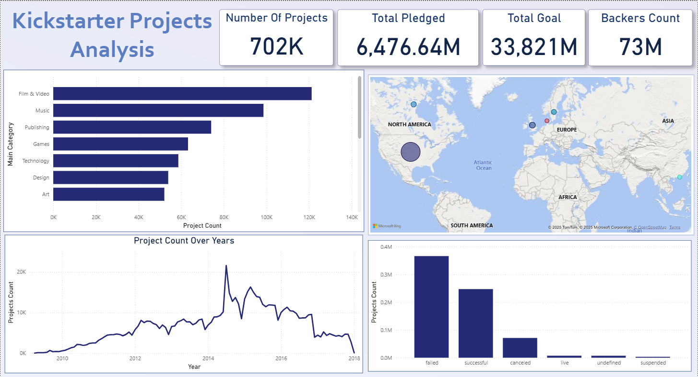

# Day01

**Kickstarter Projects**  
I worked with two CSV files (Kickstarter 2016 & 2018) from Kaggle. Cleaned and trimmed the data, added a custom column to identify the source file using M language, then appended the two files in Power Query. Renamed the final merged table for clarity and hid the unnecessary ones.  
Built a simple hierarchy (Main Category > Category > Project Name), created measures for project count, backers, total pledged, and total goal, and visualized them using cards and basic charts.

