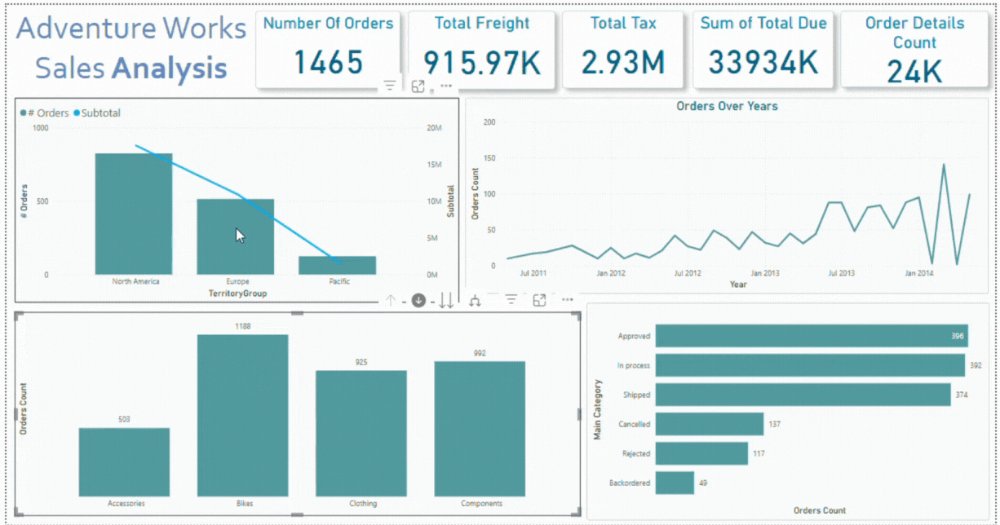

# Day02

This time I used as data source Sales.xlsx and modeled it into a star schema. Created a product hierarchy and built several measures like order count, subtotal, tax, freight, and total due. Organized the measures into a separate DAX table and added drill-down and tooltip visuals. The report includes standard cards and charts for orders by date, status, and territory, plus a comparison between orders and total due.

