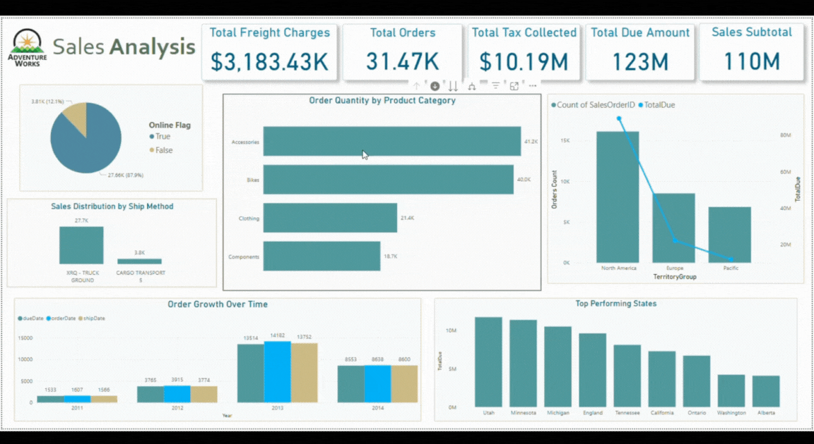

# Day03





**AdventureWorks (SQL Version)** 
- **DirectQuery** mode used for real-time connection to source.

### Tables From SQL Server

- `Sales.SalesOrderHeader`
- `Sales.SalesOrderDetail`
- `Sales.vSalesPerson` _(View)_
- `Sales.SalesTerritory`
- `Purchasing.ShipMethod`
- `Production.Product`
- `Production.ProductSubcategory`
- `Production.ProductCategory`

---
### Data Preparation

- Added **Status** table using `ufnGetSalesOrderStatusText` logic (used Enter Data)
- Created **Dates table** in Power Query using **M language (Power Query)**.
- **Renamed tables and columns** for clarity.
- **Removed unused columns** to simplify model.

---
### Data Transformation

- **Merged**: `Product`, `Subcategory`, and `Category` tables using **M language (Power Query)** into one table with:
    - `ProductID`, `Product`, `SubCategory`, `Category`

- Fixed `Subtotal`, `TotalDue`, `Tax`, `Freight` using DAX.

    - `Subtotal`  `Subtotal = SUM(OrderFact[LineTotal])`

    - `TotalDue`  `TotalDue = [Subtotal] + [TotalTax] + [TotalFreight]`

    - Tax
	 ``` DAX
     TotalTax = SUMX(SUMMARIZE(OrderFact,     OrderFact[SalesOrderID],OrderFact[TaxAmt]), OrderFact[TaxAmt])
    ```

    - Freight  
     ```DAX
     TotalFreight = SUMX(SUMMARIZE(OrderFact, OrderFact[SalesOrderID],OrderFact[Freight]), OrderFact[Freight])
     ```


---
### Data Modeling

- Built **Star Schema** model.
- Implemented **Product Hierarchy** (Category → SubCategory → Product).
- Used **USERELATIONSHIP** to enable alternate date views:
    - `orderDate`, `shipDate`, `dueDate`
    - e.g. `orderDate` 

    ```
    orderDate = CALCULATE( DISTINCTCOUNT(OrderFact[SalesOrderID]), USERELATIONSHIP(OrderFact[OrderDate], 'Date'[Date]) )
```