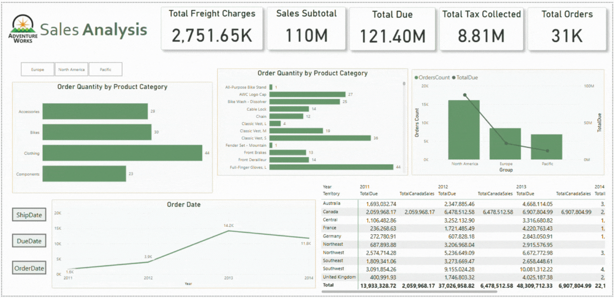

# Day04

**AdventureWorks (SQL Version)**  
Connected to AdventureWorks via Import mode and used multiple views (products, salespersons, ship methods, statuses, territories, and fact order details). I created a Date table in DAX and built hierarchies for products and dates.

Set up a star schema and handled multiple dates (order, ship, due) using `USERELATIONSHIP` in a table to compare counts across them.  
Built all key measures (orders, subtotal, tax, freight, due) and placed them in a DAX table.

The visuals included drill down and drill through, slicers synced across pages, bookmarks for toggling charts, a matrix showing sales by territory and year, and a Q&A visual. Added slicers, meaningful titles, and a clean layout with good color choices.

