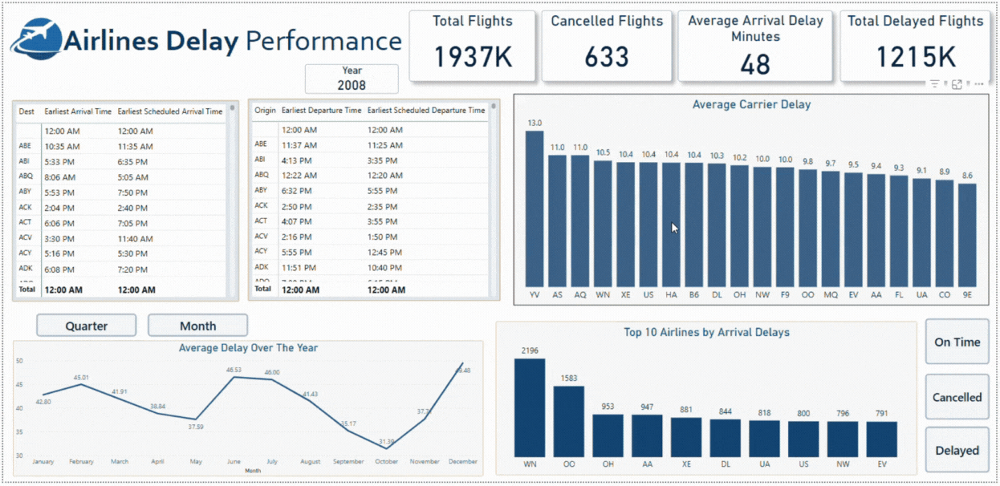

# Day05



Started with modeling the dataset for Power BI analysis, I transformed the original raw data into a clean **star schema model**, as shown in the relationship diagram. I manually created unique index columns (IDs) for each dimension table to ensure proper one-to-many relationships with the fact table. This adjustment resolved Power BI’s ambiguous relationship warnings and enabled accurate filtering across visuals.

The central table, `FactDelayedFlights`, holds the flight metrics and delay information, while the surrounding dimension tables—`DimDates`, `DimFlight`, `DimFlightPath`, and `DimAirplane`—provide structured contextual data like flight paths, dates, and carrier details.

One important part of the data cleaning involved converting all time columns, which were originally in a numeric format like `2317`, into proper `Time` data type. For example, I created a new column `Departure Time` using this DAX expression:

```dax
Departure Time = 
VAR TimeText = FORMAT([DepTime], "0000")
VAR Hour = VALUE(LEFT(TimeText, 2))
VAR Minute = VALUE(RIGHT(TimeText, 2))
RETURN TIME(Hour, Minute, 0)
```

This allowed for proper time-based visuals and more intuitive analysis of scheduled and actual flight timings.

In addition to that, I applied standard data cleaning techniques: renaming unclear columns, removing duplicates, and ensuring consistent data types across the model.