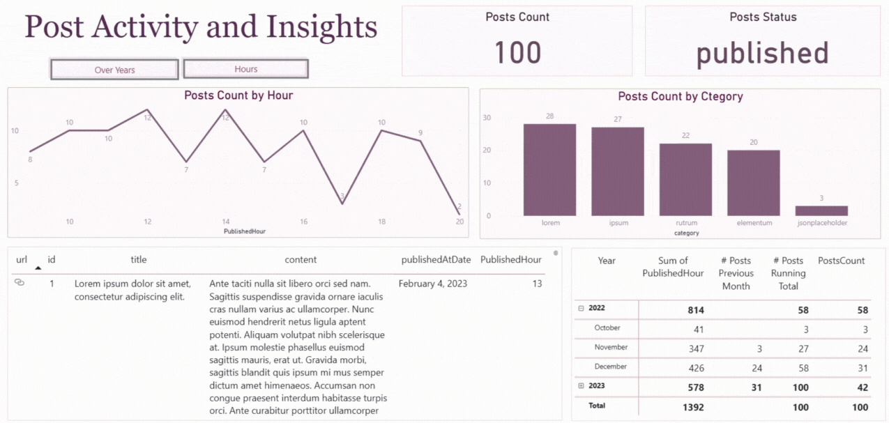

# Day06

In this lab, I built a Power BI dashboard using post data from connected to the JSON API.

I split the publishedAt and updatedAt columns into separate date and time fields, then converted the date to the proper format using the English (UK) locale. I also extracted the hour from the time column for filtering and analysis.

In the data model, I created a post URL using the slug, and added measures to calculate total posts, posts by month, running total, and posts in the previous month.

The visuals include a card for total posts, a line chart showing posts over time is displayed using two toggle buttons with bookmarks, a matrix showing monthly breakdown, and a table with post details and clickable links. The layout is optimized for both desktop and mobile, with clean titles and colors.

Finally, I published the report to Power BI Report Server.

